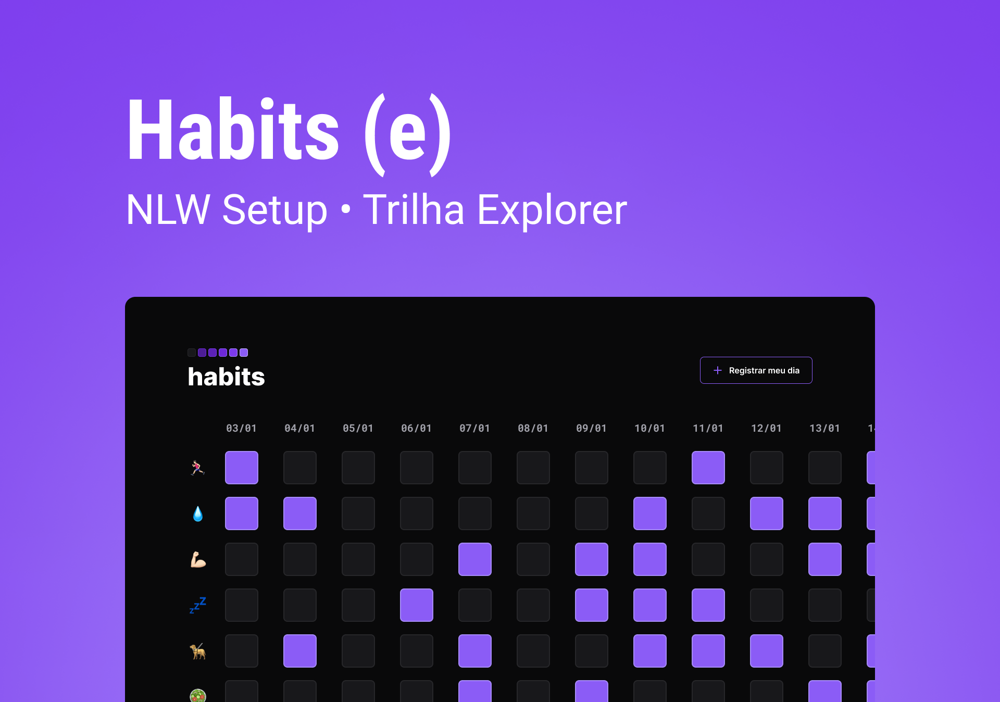

<h1 align="center"> Habits </h1>

  A free app, promoted by Rocketseat to teach WEB technologies.
  

  <a href="#-Technologies">Technologies</a>&nbsp;&nbsp;&nbsp;|&nbsp;&nbsp;&nbsp;
  <a href="#-Project">Project</a>&nbsp;&nbsp;&nbsp;|&nbsp;&nbsp;&nbsp;
  <a href="#-Layout">Layout</a>&nbsp;&nbsp;&nbsp;|&nbsp;&nbsp;&nbsp;
  <a href="#memo-licença">License</a>

  

 

  

## 🚀 Technologies

Esse projeto foi desenvolvido com as seguintes tecnologias:

- HTML e CSS
- JavaScript
- Git e Github
- Figma

## 💻 Project

The habits is an app that monitors your daily habits.

- [Visit the project online](https://jocabadasss.github.io/Habits)

## 🔖 Layout

 You can view the project layout through [DESSE LINK](<https://www.figma.com/file/pojjXRdzsxTnElltJS98WE/Habits-(e)-(Community)>). It is necessary to have a account on  [Figma](https://figma.com) To access.
